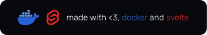
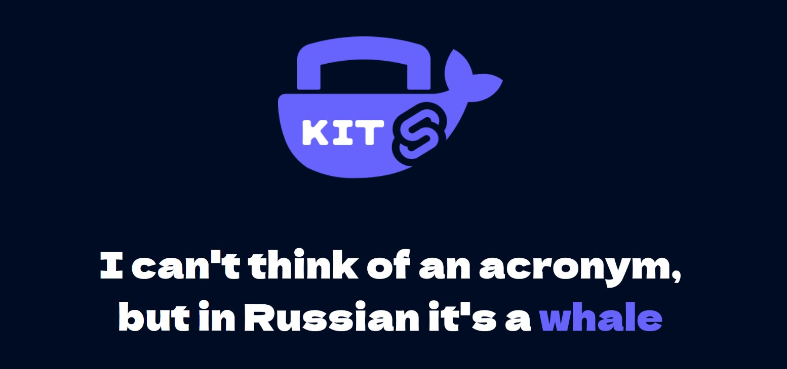

<br/>
<br/>
<div align="middle">
    
</div>

#

<h3 align="center" style="margin-bottom: 15px;">
    <strong>KIT - I can't think of an acronym, but in Russian it's a whale</strong> 
</h3>

<p align="right">
    
</p>

__Ссылки:__
* <a href="#description">Description</a>
* <a href="#install">Instalation</a>
* <a href="#build">Building</a>

<h2 id="description"><strong>Description</strong></h2>

KIT - is the ready for deployment template

__Configured:__
* Docker
* NGINX SSL auto-generation
* SvelteKit
* MongoDB

__Screenshot__
<div align="center" style="margin-top:50px">
  <a href="https://vk.com/xlsoftware" target="_blank" rel="noreferrer">
    
  </a>
</div>

<h2 id="install"><strong>Instalation</strong></h2>

Clone package from GitHub
```
mkdir <appname>
cd <appname>
npx degit xl-soft/kit

# or clone this template from github
```

Install NPM packages
```
npm i
```

create ```.env``` file in the root folder with
```bash
DOMAIN = example.com # set default domain for ssl
MONGO_USER = exampleuser  # set username
MONGO_PASSWORD = exampleuserpassword # set password
# networking
FRONTEND_PORT = 8000
```

Change name in package.json
``` json
{
    "name": "set_project_name_here",
}
```


<h2 id="build"><strong>Building</strong></h2>

Run npm script for building / testing

```bash
# auto build and deploy
npm run compile 

# if you want only build run
npm run build

# for dev enviroment run
npm run dev
```

#

<div align="center" style="margin-top:50px">
  <a href="https://vk.com/xlsoftware" target="_blank" rel="noreferrer">
    
  </a>
</div>

